# SourceBox - Project Management System

SourceBox is a comprehensive project management system designed to help you manage and streamline your projects with ease. Whether you're an individual or part of a team, SourceBox provides the tools you need to create, track, and manage your projects effectively.

## Tagline

"Streamline Your Projects, Boost Your Productivity."

## Features

1. **Login and Register**:
   - The system includes robust authentication and authorization mechanisms implemented using Spring Boot Security.
   - Users can register for new accounts, log in securely, and manage their profiles.
   - This ensures that only authorized users can access the system and its features, protecting sensitive project information.

     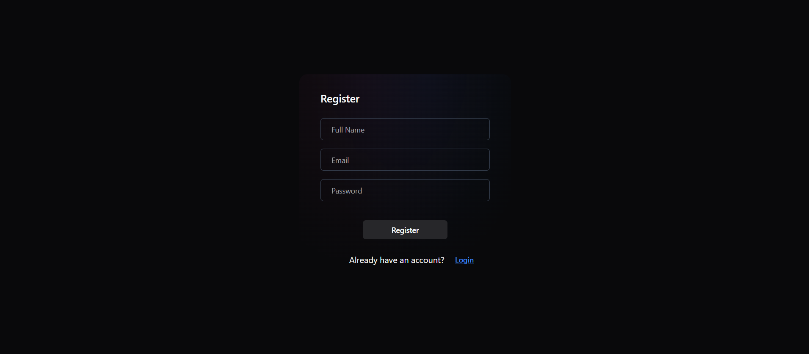
     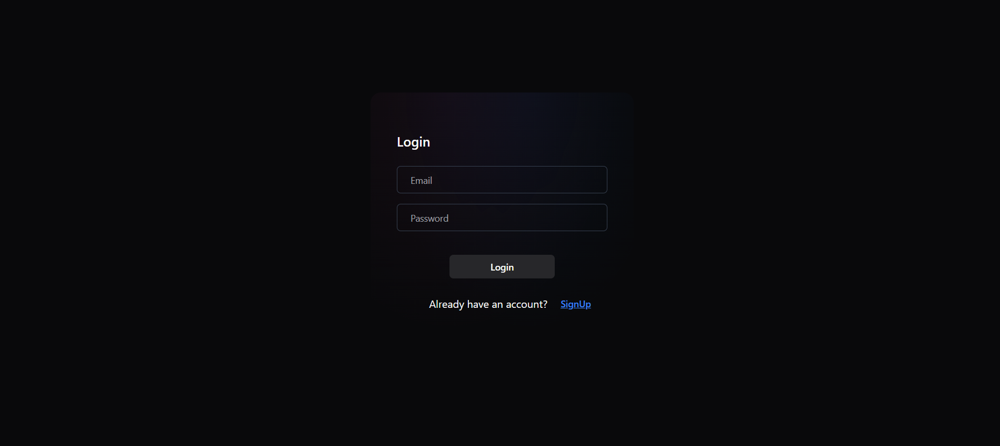

2. **Create Projects**: 
   - Users can initiate new projects by providing a project name, a detailed description, and relevant tags. Tags help in categorizing and filtering projects, making it easier to manage and locate specific projects.
   - This feature ensures that each project is well-documented from the start, with all necessary information readily available.
  
     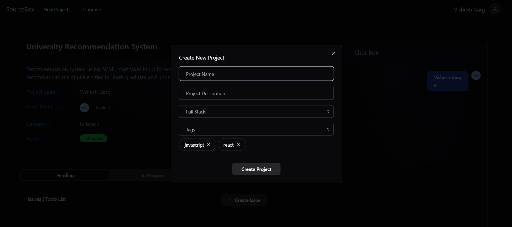

3. **View Projects**: 
   - Users have the ability to view all the projects they have created or have been invited to participate in.
   - Projects can be filtered by tags and scope, enabling users to quickly find specific projects based on their needs or interests.
   - This overview helps in keeping track of all ongoing projects and their statuses at a glance.
  
     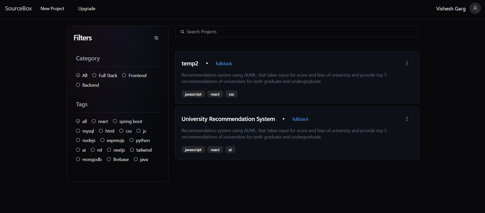

4. **View Specific Project**:
   - Users can delve into the details of any specific project. This includes viewing the project's name, description, tags, and other relevant information.
   - Users can see a list of all members involved in the project and their roles.
   - The project page also includes sections for issues and a dedicated chat area, providing a centralized location for all project-related discussions and problem-solving.

     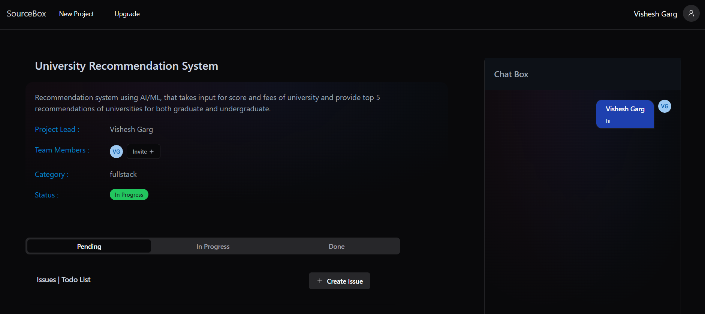

5. **Invite Users**:
   - Project owners can invite other users to join their projects through email invitations.
   - Invited users receive a link via email, which they can accept to become part of the project.
   - This feature facilitates collaboration by allowing easy onboarding of new team members.

     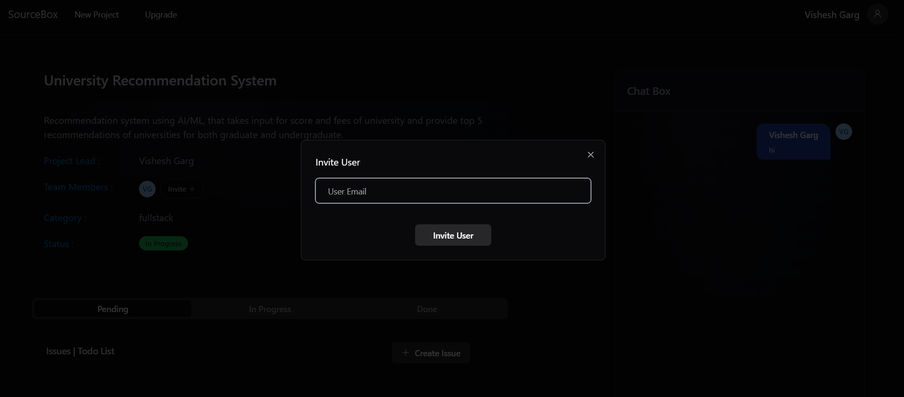

6. **Chat**:
   - Each project includes a chat feature where team members can communicate in real time.
   - This feature helps in maintaining ongoing discussions, brainstorming ideas, and resolving issues quickly without needing to switch to another communication platform.
  
     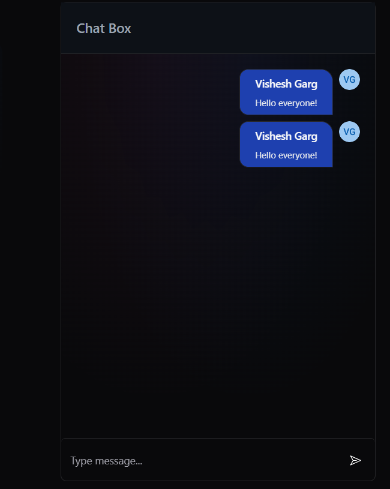

7. **Issues Management**:
   - Users can report issues related to the project and assign them to other team members.
   - Each issue can include details like a description, priority level, and due date.
   - This feature ensures that problems are documented, tracked, and resolved efficiently, helping to keep the project on track.
  
     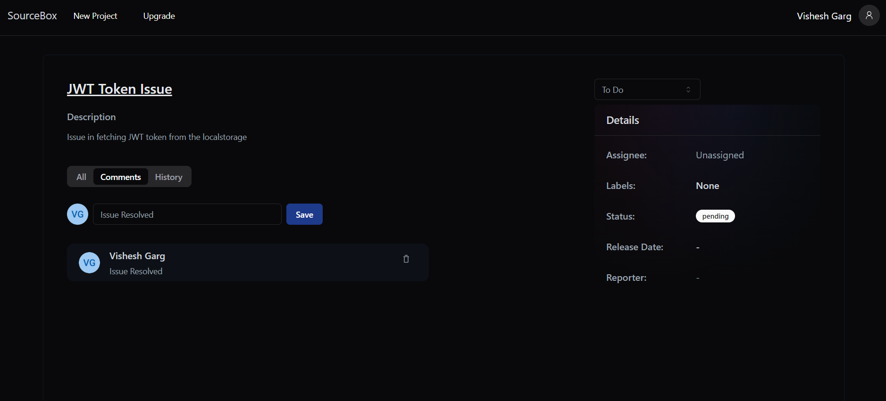

8. **View All Issues**:
   - Users can view a list of all issues they are involved in, along with their details and statuses.
   - Issues can be filtered and sorted based on various criteria, making it easy to find and manage them.
   - Users can add comments to issues, facilitating communication and collaboration on resolving the issues.
  
     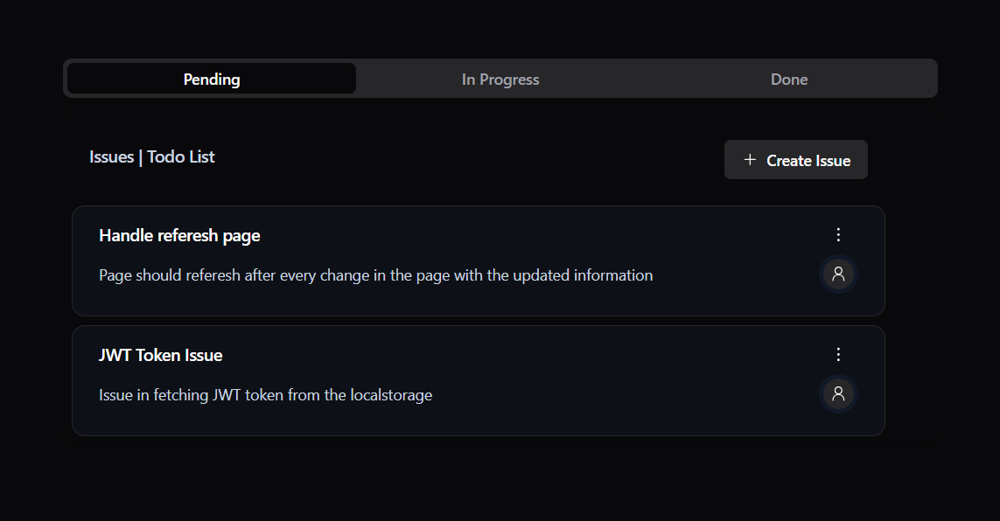

9. **Upgrade Subscription**:
   - Users have the option to upgrade their subscription plans using Razorpay.
   - Upgrading the subscription may unlock additional features and capabilities, providing more flexibility and tools for managing projects.
  
     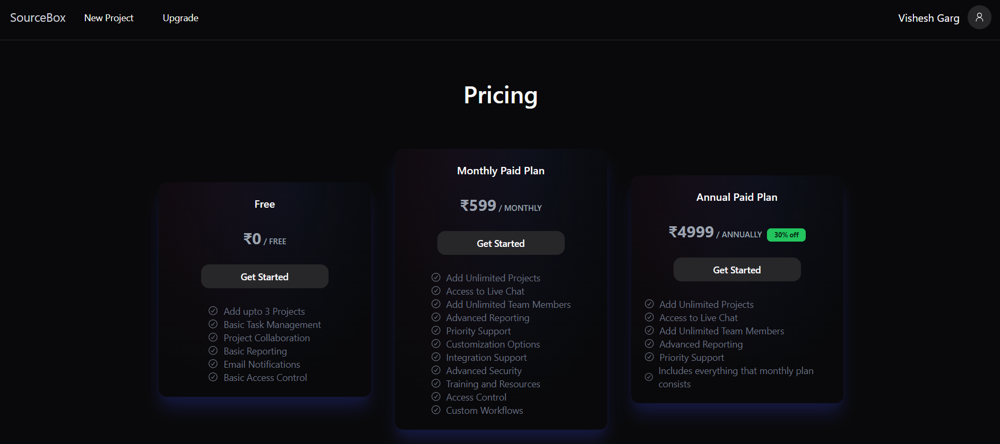

10. **Comments**:
    - Users can add comments to issues to provide updates, feedback, or additional information.
    - Comments can also be deleted by the user who posted them, ensuring that the discussion remains relevant and up-to-date.
    - This feature supports continuous communication and collaboration among team members.
   
     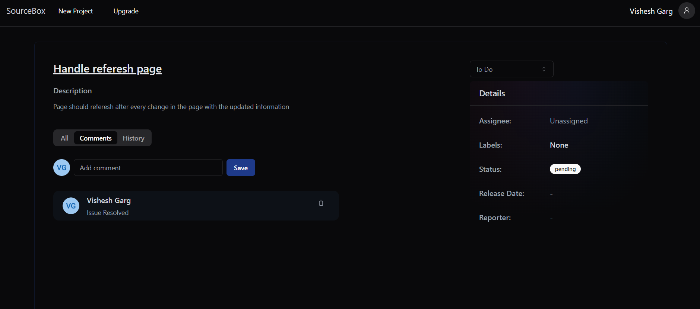

## Technologies Used

- **Backend**: Spring Boot, Hibernate, Spring Security
- **Frontend**: ReactJS, Tailwind CSS, ShadCN UI Library
- **Payment Integration**: Razorpay
- **Database**: MySQL
